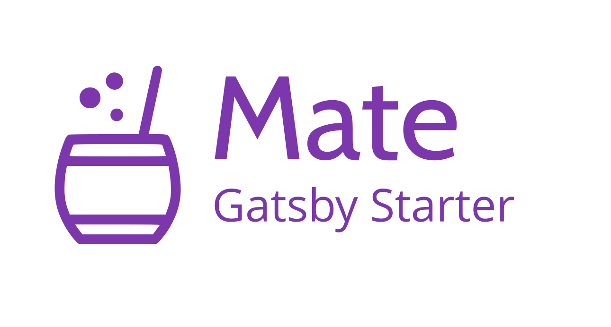
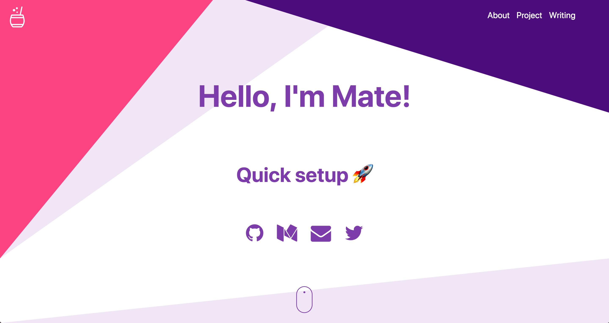

[](https://greenkeeper.io/)
[](https://travis-ci.org/EmaSuriano/gatsby-starter-mate)
[](https://eslint.org/)
[](https://github.com/prettier/prettier)
[](https://codeclimate.com/github/EmaSuriano/gatsby-starter-mate/maintainability)

# Gatsby Starter: Mate

> A portfolio starter for Gatsby integrated with Contentful CMS.

The target audience are developers 💻 and tech writers ✍️.

### [Demo Website](https://github.com/EmaSuriano/gatsby-starter-mate)

## Why? 🤔

In case you are looking for a quick setup portfolio or upgrade your current, you have to definitely try Mate!

This starter is totally content based on [Contentful](https://contentful.com), which is a headless CMS where you can write the content for your page. In summary, Contentful is the Model when Gatsby with React is the View.

At the same time, as this portfolio is written with Gatsby is extremely easy to add more than one source of data! For example, the demo comes with an integration of [Medium](https://medium.com) posts based on a user name ✌️

## Features 🛠

- [Gatsby v2](https://www.gatsbyjs.org/)
- [Rebass](https://rebassjs.org/): styled component system
- [React Reveal](https://www.react-reveal.com/)
- Dynamic content from [Contentful](https://contentful.com)
- Offline support
- PWA ready
- SEO
- Responsive design
- Icons from [font-awesome](https://fontawesome.com/)
- [Netlify](https://www.netlify.com) Deployment Friendly
- Medium integration
- Social sharing (Twitter, Facebook, Google, LinkedIn)
- Developer tools:
  - eslint
  - prettier

## How to start ▶️

If you never used Gatsby before, I highly recommend you to [Set up your development environment](https://www.gatsbyjs.org/tutorial/part-zero/)!

To copy and install this starter run this command:

```bash
$ gatsby new mate-portofolio https://github.com/EmaSuriano/gatsby-starter-mate
```

At this point you have the repository download with all the dependencies installed, but if you try to start by running `yarn develop` you are going to received this message in the console:

```bash
  TypeError: Expected parameter accessToken
```

This is because you didn't specify from which `Contentful` space the portfolio will take the information. So the next step is create an empty space in [Contentful](https://www.contentful.com/)!

After the space is created, run the following command:

```bash
yarn setup
```

This CLI will request 3 values:

- `Space ID`
- `Content Delivery API - access token`
- `Personal Access Token`

These 3 values are inside the Settings section --> API keys.

After you provide them the CLI will automatically starts copying all the `Content models` and `Contents` from `mate-demo-contentful` to your space ✨

If everything went smooth you should see something like this in your terminal:

```text
Writing config file...
Config file /Users/my-user/Git/test/mate-portofolio/.env written
┌──────────────────────────────────────────────────┐
│ The following entities are going to be imported: │
├─────────────────────────────────┬────────────────┤
│ Content Types                   │ 3              │
├─────────────────────────────────┼────────────────┤
│ Editor Interfaces               │ 3              │
├─────────────────────────────────┼────────────────┤
│ Entries                         │ 8              │
├─────────────────────────────────┼────────────────┤
│ Assets                          │ 6              │
├─────────────────────────────────┼────────────────┤
│ Locales                         │ 1              │
├─────────────────────────────────┼────────────────┤
│ Webhooks                        │ 0              │
└─────────────────────────────────┴────────────────┘
 ✔ Validating content-file
 ✔ Initialize client (1s)
 ✔ Checking if destination space already has any content and retrieving it (2s)
 ✔ Apply transformations to source data (1s)
 ✔ Push content to destination space
   ✔ Connecting to space (1s)
   ✔ Importing Locales (1s)
   ✔ Importing Content Types (4s)
   ✔ Publishing Content Types (3s)
   ✔ Importing Editor Interfaces (3s)
   ✔ Importing Assets (7s)
   ✔ Publishing Assets (3s)
   ✔ Archiving Assets (1s)
   ✔ Importing Content Entries (1s)
   ✔ Publishing Content Entries (5s)
   ✔ Archiving Entries (1s)
   ✔ Creating Web Hooks (0s)
Finished importing all data
```

After this step we can finally run the project and see the result in http://localhost:8000/ 😃

```bash
yarn develop
```



## Building your site 📦

As we are dealing with environment variables, the `.env` file is excluded from `.gitignore` file. Therefore, in order to deploy the website you have to send `SPACE_ID` and `ACCESS_TOKEN` with the `build` command.

```bash
SPACE_ID=xxxxx ACCESS_TOKEN=yyyyy yarn build
```

The result will be stored inside the `public` folder, so you can upload to your webhost. I highly suggest using this starter with Netlify when you can define which command will build the project and also send the environment variables inside the website configuration.

## Adding your information 📝

All the text of this starter live inside Contentful, more spefically inside the Content of `About`. In order to change it, just go to `Content` section and change the entity of About with the information you want.


Regarding the projects and social links the process is the same! Contentful is really easy to learn so don't be afraid of breaking everything, remember that you can restore to the start point by running `yarn setup` 😄

## Configuration 👷‍♂️

Mate starter is a SPA (Single Page Application), so basically you have only two pages:

- Main.js (portfolio itself)
- 404.js (nice 404 error page that match the style)

The structure for the main page is the following:

```javascript
<Layout>
  <Landing />
  <About />
  <Projects />
  <Writing />
</Layout>
```

`Layout` is the core of the application, it manages the theme for the application, the navigation between sections, also it defines the `header`.

All the components inside `Layout` are `Section` components. A section can have a link inside the `Header` or not, in order to add you need to wrapped the exported `Section` with `withNavigation` HOC and it will be automatically registered (Context magic ✨).

## Contributing 💪

I came with the idea of creating the starter after the positive feedback I received when I deployed [my website](emasuriano.com).

Therefore this starter is not perfect! I tried my best to remove all the personal information, also improve the code to make it easier to understand.

I'm totally for new PRs with bug fixes, change in Documentation, and new features to the starter 🙌

## License 📝

MIT.
