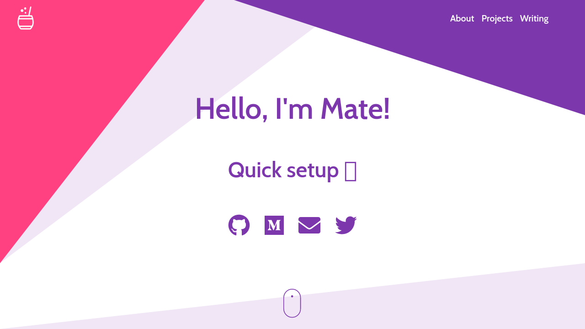
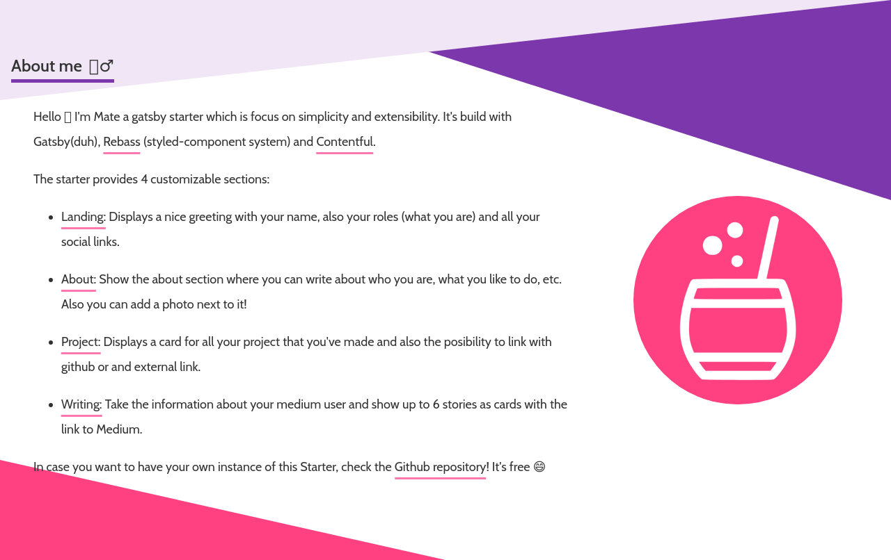
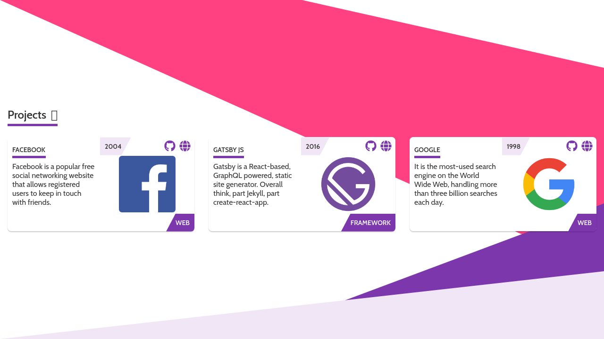
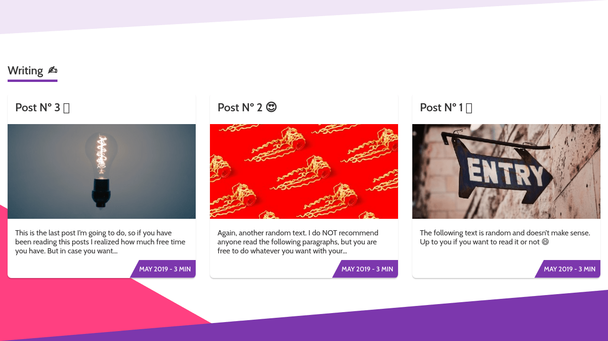
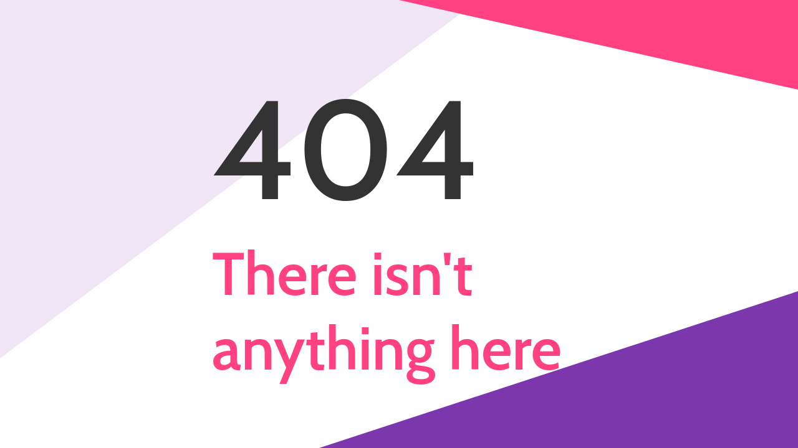
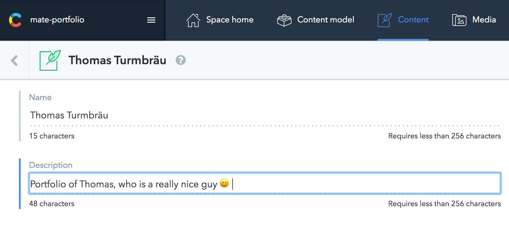
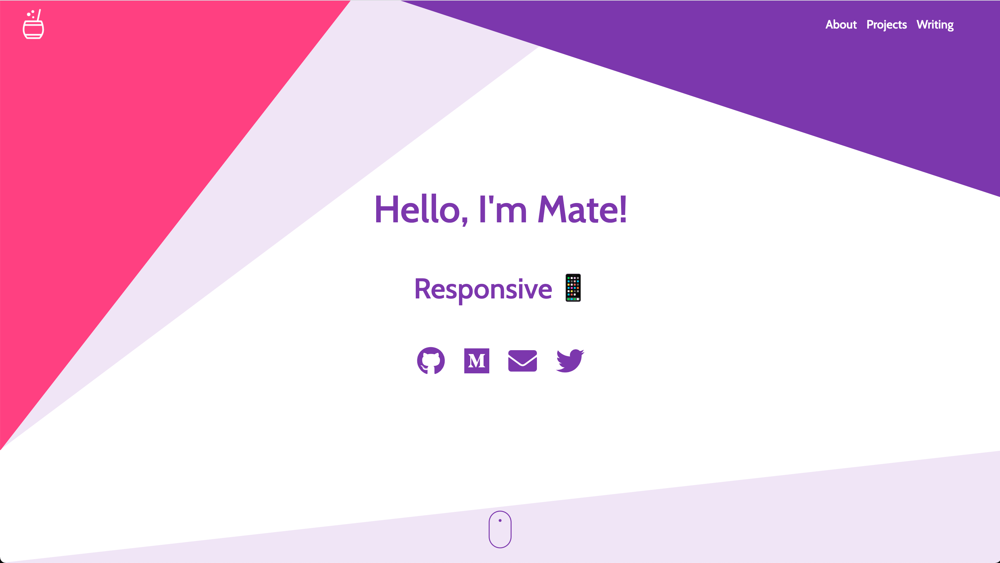
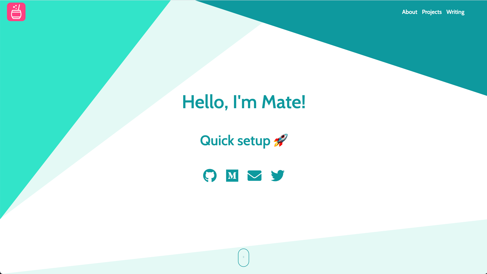
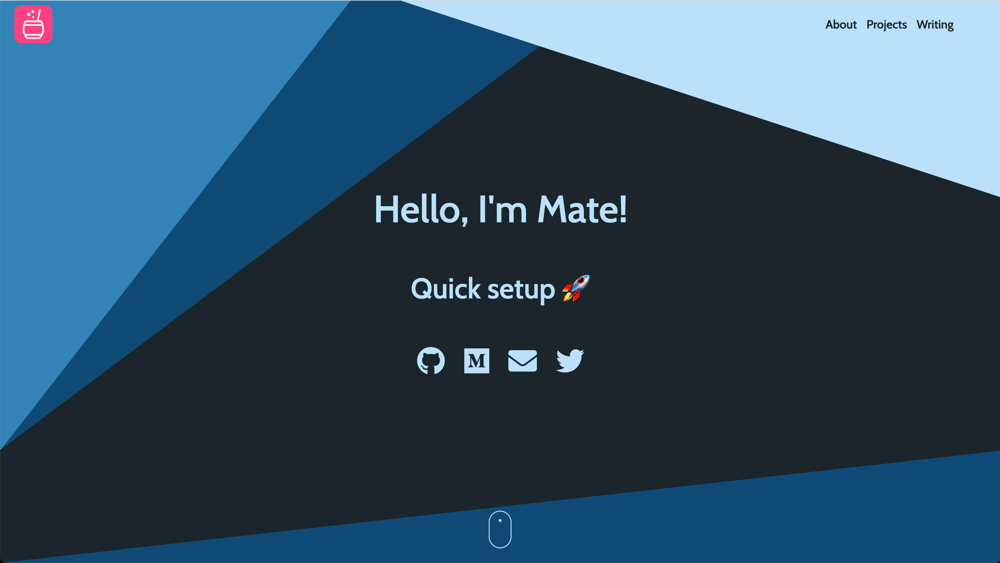

# Gatsby Starter: Mate 🧉

[](https://github.com/EmaSuriano/gatsby-starter-mate/actions/workflows/master.yml)
[](https://app.netlify.com/sites/gatsby-starter-mate/deploys)

> An accessible and fast portfolio starter for Gatsby integrated with Contentful CMS.

The target audience are Developers 💻 and Tech Writers ✍️.

**[Check the Demo ✨](https://gatsby-starter-mate.netlify.app/)**

## Why? 🤔

In case you are looking for a quick setup portfolio or upgrade your current, you have to definitely try Mate!

This starter is totally content based on [Contentful](https://contentful.com), which is a headless CMS where you can write the content for your page. In summary, Contentful is the Model when Gatsby with React is the View.

At the same time, as this portfolio is written with Gatsby is extremely easy to add more than one source of data! For example, the demo comes with an integration of [Medium](https://medium.com) posts based on a user name ✌️

## Features 🛠

- [Gatsby 5](https://www.gatsbyjs.org/)
- [Rebass](https://rebassjs.org/): styled component system
- [React Awesome Reveal](https://github.com/dennismorello/react-awesome-reveal)
- CMS Integration with [Contentful](https://contentful.com)
- PWA ready
- SEO
- Responsive design
- Icons from [font-awesome](https://fontawesome.com/)
- [Netlify](https://www.netlify.com) and [Gatsby Cloud](https://www.gatsbyjs.com/products/cloud/) Deployment Friendly
- Medium integration
- Social sharing (Twitter, Facebook, Google, LinkedIn)
- Google Analytics integration

## How to start

As this process needs more steps compared to other starters, I decided to made a tutorial video of how to set up your own instance of Mate. You can follow the video or jump directly to the written documentation.

<p align="center">
  <a href="https://www.youtube.com/watch?v=YviWsypJF9c">
   
  </a>
</p>

If you never used Gatsby before, I highly recommend you to [Set up your development environment](https://www.gatsbyjs.org/tutorial/part-zero/)!

Also, it's recommended that you use `Yarn` as your Package Manager inside `gatsby-cli`:

```bash
$ gatsby options set pm yarn
info Preferred package manager set to "yarn"
```

To copy and install this starter run this command:

```bash
$ gatsby new mate-portfolio https://github.com/EmaSuriano/gatsby-starter-mate
```

At this point you have the repository download with all the dependencies installed, but if you try to start by running `yarn develop` you are going to received this message in the console:

```bash
  TypeError: Expected parameter accessToken
```

This is because you didn't specify from which `Contentful` space the portfolio will take the information. So the next step is create an empty space in [Contentful](https://www.contentful.com/)!

After the space is created, run the following command:

```bash
yarn setup
```

This CLI will request 3 values:

- `Space ID`
- `Content Delivery API - access token`
- `Personal Access Token`

These 3 values are inside the Settings section --> API keys.

After you provide them the CLI will automatically starts copying all the `Content models` and `Contents` from `mate-demo-contentful` to your space ✨

If everything went smooth you should see something like this in your terminal:

```text
Writing config file...
Config file /Users/my-user/Git/test/mate-portfolio/.env written
┌──────────────────────────────────────────────────┐
│ The following entities are going to be imported: │
├─────────────────────────────────┬────────────────┤
│ Content Types                   │ 3              │
├─────────────────────────────────┼────────────────┤
│ Editor Interfaces               │ 3              │
├─────────────────────────────────┼────────────────┤
│ Entries                         │ 8              │
├─────────────────────────────────┼────────────────┤
│ Assets                          │ 6              │
├─────────────────────────────────┼────────────────┤
│ Locales                         │ 1              │
├─────────────────────────────────┼────────────────┤
│ Webhooks                        │ 0              │
└─────────────────────────────────┴────────────────┘
 ✔ Validating content-file
 ✔ Initialize client (1s)
 ✔ Checking if destination space already has any content and retrieving it (2s)
 ✔ Apply transformations to source data (1s)
 ✔ Push content to destination space
   ✔ Connecting to space (1s)
   ✔ Importing Locales (1s)
   ✔ Importing Content Types (4s)
   ✔ Publishing Content Types (3s)
   ✔ Importing Editor Interfaces (3s)
   ✔ Importing Assets (7s)
   ✔ Publishing Assets (3s)
   ✔ Archiving Assets (1s)
   ✔ Importing Content Entries (1s)
   ✔ Publishing Content Entries (5s)
   ✔ Archiving Entries (1s)
   ✔ Creating Web Hooks (0s)
Finished importing all data
```

After this step we can finally run the project and see the result in http://localhost:8000/ 😃

```bash
$ yarn start
```

## Screenshot and Design

As the starter is a SPA it only has two routes:

- `/`: main page with the sections of `Home`, `About me`, `Projects` and `Writing`.
- `/404`: error page for unexpected route.

| Section  |                 Screenshot                  |
| -------- | :-----------------------------------------: |
| Home     |       |
| About me |     |
| Projects |  |
| Writing  |    |
| 404      |            |

## Building your site

As we are dealing with environment variables, the `.env` file is excluded from `.gitignore` file. Therefore, in order to deploy the website you have to send `SPACE_ID` and `ACCESS_TOKEN` with the `build` command.

```bash
SPACE_ID=xxxxx ACCESS_TOKEN=yyyyy yarn build
```

The result will be stored inside the `public` folder, so you can upload to your web host. I highly suggest using this starter with Netlify when you can define which command will build the project and also send the environment variables inside the website configuration.

## Customization

When you first bootstrap the project, you will notice that it doesn't contain many files. This is because of how the project is structured, for example where is the data coming from and how it is displayed to the user. The starter is based on 2 principles:

1. Data coming from an external source: Contentful. Therefore in case you want to change the content of the website, please refer to [Adding your information section](#adding-your-information).
2. Components and pages decoupled inside a Gatsby Theme: [gatsby-theme-mate](https://github.com/EmaSuriano/gatsby-theme-mate). The reason behind it is to provide an easy way to keep your starter up to date. To know more about Gatsby Theme, please refer to the [official documentation](https://www.gatsbyjs.com/docs/themes/). Most common customizations:
   1. [Theming](#theming)
   2. [Changing Icons](#changing-icons)
   3. [Modifying the Sections](#modifying-the-sections)

### Adding your information

All the information of this starter resides inside [Contentful](https://www.contentful.com/), inside the Content of `About`. To change it, just go to the `Content` section and change the entity with the information you want.



Regarding the projects and social links, the process is the same! Contentful is easy to learn so don't be afraid of breaking everything, remember that you can restore to the start point by running `yarn setup` 😄

### Theming

Thanks to the [Theme Shadowing](https://www.gatsbyjs.com/docs/how-to/plugins-and-themes/shadowing/), changing the colors of your portfolio is quite easy! You have to create a new file located at `src/gatsby-theme-mate/colors.json`. Some examples I made by using palettes from [Color Hunt](https://colorhunt.co/):

| Name     | Code                                                                                                               | Screenshot                                     |
| -------- | ------------------------------------------------------------------------------------------------------------------ | ---------------------------------------------- |
| Original | `{ "text": "#333333", "background": "#FFFFFF", "muted": "#f0e6f6", "primary": "#7c37ad", "secondary": "#ff4081" }` |  |
| Teal     | `{ "text": "#40514e", "background": "#FFFFFF", "muted": "#e4f9f5", "primary": "#11999e", "secondary": "#30e3ca" }` |           |
| Dark     | `{ "text": "#e3e3e3", "background": "#1b262c", "muted": "#0f4c75", "primary": "#bbe1fa", "secondary": "#3282b8" }` |      |

### Changing Icons

This project is using the icons from [Font Awesome](https://fontawesome.com/), with the implementation made by [fortawesome](https://fortawesome.com/). A good practice when dealing with icons is to load **only** the ones that the project is going to use. Therefore not all the icons inside FA are loaded by default.

To change the icons used in your portfolio, you have to make use of [Theme Shadowing](https://www.gatsbyjs.com/docs/how-to/plugins-and-themes/shadowing/) and create a file located at `src/gatsby-theme-mate/icons.js` with your icons. By default this is the content of the file:

```javascript
import {
  faMedium,
  faTwitter,
  faGithub,
} from '@fortawesome/free-brands-svg-icons';
import {
  faGlobe,
  faEnvelope,
  faCoffee,
} from '@fortawesome/free-solid-svg-icons';

export const ICONS = [
  faMedium,
  faTwitter,
  faGithub,
  faGlobe,
  faEnvelope,
  faCoffee,
];
```

Simply import the icons you want to use either `@fortawesome/free-brands-svg-icons` or `@fortawesome/free-solid-svg-icons` and export them inside the `ICONS` array. They get loaded as soon as the app starts.

### Modifying the Sections

This starter by default provides 4 different sections:

- Landing: your name, roles, and social links.
- About: information about yourself plus the image on the side.
- Projects: summary of the projects you worked on.
- Writing: articles from Medium you wrote (this will be visible only if you specify a Medium user).

In case you want to change the order, remove or even add new sections. You can do it by using the feature of [Theme Shadowing](https://www.gatsbyjs.com/docs/how-to/plugins-and-themes/shadowing/) and create a file inside `src/gatsby-theme-mate/templates/Home.js` and have total control over what you want to render. This will be an example of swapping between the About and Projects section.

```jsx
import React from 'react';

// Layout components
import Layout from 'gatsby-theme-mate/src/components/Layout';
import Header from 'gatsby-theme-mate/src/components/Header';
import Footer from 'gatsby-theme-mate/src/components/Footer';

// Sections that will fetch data for you
import Landing from 'gatsby-theme-mate/src/sections/Landing';
import About from 'gatsby-theme-mate/src/sections/About';
import Projects from 'gatsby-theme-mate/src/sections/Projects';
import Writing from 'gatsby-theme-mate/src/sections/Writing';

const Home = () => (
  <Layout>
    <Header />
    <Landing />
    <Projects />
    <About />
    <Writing />
    <Footer />
  </Layout>
);

export default Home;
```

By following this approach it's possible to modify the code of any component of the project. But please be aware, that by using Theme Shadowing you are going to **always override** the content of this, so in case there will be an update of the same file inside `gatsby-theme-mate` you are not going to use it.

My final recommendation with shadowing is to try to keep as minimum as possible to avoid having breaking changes between new releases of the theme.

## Tracking with Google Analytics (Optional)

This starter has the analytics plugin inside the `gatsby-config`, so the only need to do in order to enable it is to provide the `Tracking Id` for your site (starts with `UA-`). Just set a new variable inside your `.env` file called `ANALYTICS_ID` and analytics will be turn on automatically 😄
