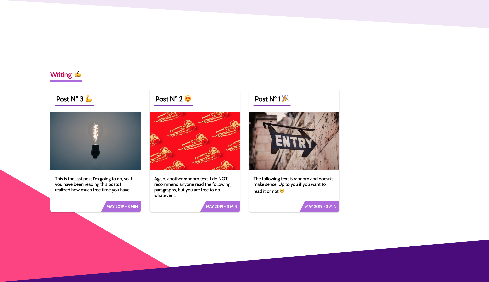

# Gatsby Starter: Mate

[](https://travis-ci.org/EmaSuriano/gatsby-starter-mate)
[](https://eslint.org/)
[](https://github.com/prettier/prettier)
[](https://percy.io/Ema-suriano/gatsby-starter-mate)


> An accessible and fast portfolio starter for Gatsby integrated with Contentful CMS.

The target audience are Developers 💻 and Tech Writers ✍️.

## [Check the Demo ✨](https://gatsby-starter-mate.netlify.com/)

<style>.bmc-button img{width: 27px !important;margin-bottom: 1px !important;box-shadow: none !important;border: none !important;vertical-align: middle !important;}.bmc-button{line-height: 36px !important;height:37px !important;text-decoration: none !important;display:inline-flex !important;color:#ffffff !important;background-color:#BB5794 !important;border-radius: 3px !important;border: 1px solid transparent !important;padding: 1px 9px !important;font-size: 22px !important;letter-spacing:0.6px !important;box-shadow: 0px 1px 2px rgba(190, 190, 190, 0.5) !important;-webkit-box-shadow: 0px 1px 2px 2px rgba(190, 190, 190, 0.5) !important;margin: 0 auto !important;font-family:'Cookie', cursive !important;-webkit-box-sizing: border-box !important;box-sizing: border-box !important;-o-transition: 0.3s all linear !important;-webkit-transition: 0.3s all linear !important;-moz-transition: 0.3s all linear !important;-ms-transition: 0.3s all linear !important;transition: 0.3s all linear !important;}.bmc-button:hover, .bmc-button:active, .bmc-button:focus {-webkit-box-shadow: 0px 1px 2px 2px rgba(190, 190, 190, 0.5) !important;text-decoration: none !important;box-shadow: 0px 1px 2px 2px rgba(190, 190, 190, 0.5) !important;opacity: 0.85 !important;color:#ffffff !important;}</style><link href="https://fonts.googleapis.com/css?family=Cookie" rel="stylesheet"><a class="bmc-button" target="_blank" href="https://www.buymeacoffee.com/emasuriano"><span style="margin-left:5px">Buy me a coffee</span></a>

## Why? 🤔

In case you are looking for a quick setup portfolio or upgrade your current, you have to definitely try Mate!

This starter is totally content based on [Contentful](https://contentful.com), which is a headless CMS where you can write the content for your page. In summary, Contentful is the Model when Gatsby with React is the View.

At the same time, as this portfolio is written with Gatsby is extremely easy to add more than one source of data! For example, the demo comes with an integration of [Medium](https://medium.com) posts based on a user name ✌️

## Features 🛠

- [Gatsby v2](https://www.gatsbyjs.org/)
- [Rebass 3.0 🎉](https://rebassjs.org/): styled component system
- [React Reveal](https://www.react-reveal.com/)
- Dynamic content from [Contentful](https://contentful.com)
- Offline support
- PWA ready
- SEO
- Responsive design
- Icons from [font-awesome](https://fontawesome.com/)
- [Netlify](https://www.netlify.com) Deployment Friendly
- Medium integration
- Social sharing (Twitter, Facebook, Google, LinkedIn)
- Developer tools:
  - `eslint`
  - `prettier`
- Google Analytics integration
- End to End with Cypress:
  - A11y testing with [Axe](https://www.deque.com/axe/)
  - Visual Testing with [Percy](https://percy.io/)

### Lighthouse Score 💯


## How to start ▶️

As this process needs more steps compared to other starters, I decided to made a tutorial video of how to set up your own instance of Mate. You can follow the video or jump directly to the written documentation.

<p align="center">
  <a href="https://www.youtube.com/watch?v=YviWsypJF9c">
   
  </a>
</p>

If you never used Gatsby before, I highly recommend you to [Set up your development environment](https://www.gatsbyjs.org/tutorial/part-zero/)!

To copy and install this starter run this command:

```bash
$ gatsby new mate-portfolio https://github.com/EmaSuriano/gatsby-starter-mate
```

At this point you have the repository download with all the dependencies installed, but if you try to start by running `npm run develop` you are going to received this message in the console:

```bash
  TypeError: Expected parameter accessToken
```

This is because you didn't specify from which `Contentful` space the portfolio will take the information. So the next step is create an empty space in [Contentful](https://www.contentful.com/)!

After the space is created, run the following command:

```bash
npm run setup
```

This CLI will request 3 values:

- `Space ID`
- `Content Delivery API - access token`
- `Personal Access Token`

These 3 values are inside the Settings section --> API keys.

After you provide them the CLI will automatically starts copying all the `Content models` and `Contents` from `mate-demo-contentful` to your space ✨

If everything went smooth you should see something like this in your terminal:

```text
Writing config file...
Config file /Users/my-user/Git/test/mate-portfolio/.env written
┌──────────────────────────────────────────────────┐
│ The following entities are going to be imported: │
├─────────────────────────────────┬────────────────┤
│ Content Types                   │ 3              │
├─────────────────────────────────┼────────────────┤
│ Editor Interfaces               │ 3              │
├─────────────────────────────────┼────────────────┤
│ Entries                         │ 8              │
├─────────────────────────────────┼────────────────┤
│ Assets                          │ 6              │
├─────────────────────────────────┼────────────────┤
│ Locales                         │ 1              │
├─────────────────────────────────┼────────────────┤
│ Webhooks                        │ 0              │
└─────────────────────────────────┴────────────────┘
 ✔ Validating content-file
 ✔ Initialize client (1s)
 ✔ Checking if destination space already has any content and retrieving it (2s)
 ✔ Apply transformations to source data (1s)
 ✔ Push content to destination space
   ✔ Connecting to space (1s)
   ✔ Importing Locales (1s)
   ✔ Importing Content Types (4s)
   ✔ Publishing Content Types (3s)
   ✔ Importing Editor Interfaces (3s)
   ✔ Importing Assets (7s)
   ✔ Publishing Assets (3s)
   ✔ Archiving Assets (1s)
   ✔ Importing Content Entries (1s)
   ✔ Publishing Content Entries (5s)
   ✔ Archiving Entries (1s)
   ✔ Creating Web Hooks (0s)
Finished importing all data
```

After this step we can finally run the project and see the result in http://localhost:8000/ 😃

```bash
npm start
```

## Screenshot and Design 🖼

As the starter is a SPA it only has two routes:

- `/`: main page with the sections of `Home`, `About me`, `Projects` and `Writing`.
- `/404`: error page for unexpected route.

| Section  |           Screenshot            |
| -------- | :-----------------------------: |
| Home     |          |
| About me |     |
| Projects |  |
| Writing  |    |
| /404     |            |

## Building your site 📦

As we are dealing with environment variables, the `.env` file is excluded from `.gitignore` file. Therefore, in order to deploy the website you have to send `SPACE_ID` and `ACCESS_TOKEN` with the `build` command.

```bash
SPACE_ID=xxxxx ACCESS_TOKEN=yyyyy npm run build
```

The result will be stored inside the `public` folder, so you can upload to your web host. I highly suggest using this starter with Netlify when you can define which command will build the project and also send the environment variables inside the website configuration.

## Adding your information 📝

All the text of this starter live inside Contentful, specifically inside the Content of `About`. In order to change it, just go to `Content` section and change the entity of About with the information you want.


Regarding the projects and social links the process is the same! Contentful is really easy to learn so don't be afraid of breaking everything, remember that you can restore to the start point by running `npm run setup` 😄

## End to End Testing with Cypress 🧪

The starter comes with a built in End to End Setup using Cypress. As there are no complex logic flow, there are only two tests in place:

1. Accessibility check: using the [cypress-axe](https://www.npmjs.com/package/cypress-axe) plugin you can easily check a lot of a11y rules at once powered by [Axe](https://www.deque.com/axe/)!
2. Visual testing: using [percy-cypress](https://github.com/percy/percy-cypress) plugin you can take screenshot with different resolutions and easily the difference inside their platform. [Here](https://percy.io/Ema-suriano/gatsby-starter-mate) you can check the Percy dashboard for this project.

### Setting Visual Testing for your project (Optional) 📸

By default, the visual testing will fail due to Percy needs a Token in order to know with which project of your account is related. The steps to set up your own visual testing workflow is:

- Create a project in [Percy](https://percy.io/).
- Go to "Project settings" -> "Project token" and copy the whole line saying "PERCY_TOKEN=<YOUR_TOKEN>".
- Open the `.env` file located in the root of the project and add the token to your credentials.
- Try running `npm run e2e:ci` and you should be able to see a new build inside your Project Dashboard in Percy.

## Configuration (Optional) 👷‍♂️

Mate starter is a SPA (Single Page Application), so basically you have only two pages:

- `Main.js`: portfolio itself
- `404.js`: 404 error page with the same style

The structure for the main page is the following:

```javascript
<Layout>
  <Landing />
  <About />
  <Projects />
  <Writing />
</Layout>
```

`Layout` is the core of the application, it manages the theme for the application, the navigation between sections, also it defines the `header`.

All the components inside `Layout` are `Section` components. A section can have a link inside the `Header` or not, in order to add you need to wrapped the exported `Section` with `withNavigation` HOC and it will be automatically registered (Context magic ✨).

## Tracking with Google Analytics (Optional) 📈

This starter has the analytics plugin inside the `gatsby-config`, so the only need to do in order to enable it is to provide the `Tracking Id` for your site (starts with `UA-`). Just set a new variable inside your `.env` file called `ANALYTICS_ID` and analytics will be turn on automatically 😄

## Update your Starter (Optional) 💡

In case you cloned this repository before and you want all the latest changes of it, you can execute the following command to update the code in your repository with the one in this repository:

```bash
# Add repository remote entry
$ git remote add mate https://github.com/EmaSuriano/gatsby-starter-mate

# Get changes from master branch of gatsby-starter-mate
$ git pull mate master --allow-unrelated-histories

# Reset changes in unnecessary folder/files
$ git reset media/ bin/ README.md manifest-config.js

# Remove files affected by the reset
$ git checkout .

# In this step you might need to fix a lot of conflicts, you can do fix manually or use just accept all the changes from mate
$ git checkout --theirs .

# WATCH OUT that some configuration can be overwritten in this last step, like package.json, colors, etc. I highly recommend to do an overall look up at the end of fixing the conflicts.

# Install in case there is any new dependency added to the starter
$ npm install

# Build the project to see if everything is working as expected
$ nmp run build
```

## Deployment Automation (Optional) ⚙️

Every time you made a change in your Contentful data or you add a new post in Medium you need to trigger a manual deployment, which can be an annoying task. Therefore I found a nice way to make this process automatic and it is by using a tool called Zapier.

This tool will be watching for changes in Contentful and Medium and then trigger a new deploy in Netlify (or the service you are using). In summary, you don't need to care anymore about deploying your application and can focus on writing content or developing features!

In case you want to know more I wrote an article in Medium that explains the whole process especially for this starter 🙌 [Click here to read it.](https://medium.com/@emasuriano/make-any-static-site-dynamic-without-coding-9dde5673b1a)

**UPDATE:** Contentful added a feature to link it with Netlify as a built in option, but in case you are using another provider I recommend going with Zapier!

## Contributing 💪

I came with the idea of creating the starter after the positive feedback I received when I deployed [my website](https://emasuriano.com/). Therefore this starter is not perfect! I tried my best to remove all the personal information, also improve the code to make it easier to understand.

I'm totally open for pull requests with bug fixes, changes in Documentation, or new features to the starter 🙌

Please check the [Contribution guidelines](CONTRIBUTING.md) before opening yours 🙏

## License 📝

MIT.
